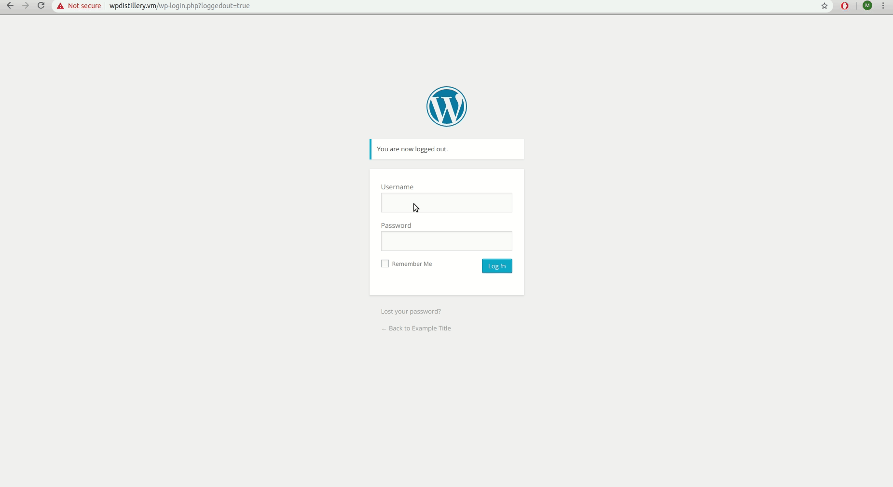
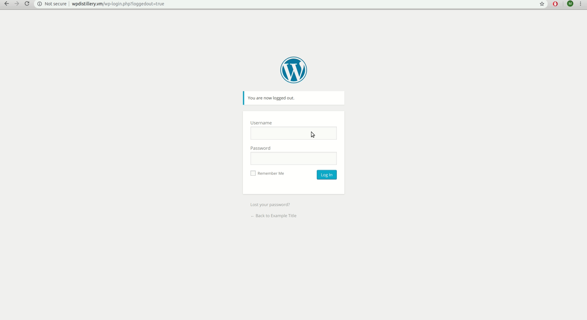

# Project 7 - WordPress Pentesting

Time spent: **6** hours spent in total

> Objective: Find, analyze, recreate, and document **five vulnerabilities** affecting an old version of WordPress

## Pentesting Report

1. Stored Cross-Site Scripting
  - [x] Summary: A user with editing privileges can inject a script in a reply message which is executed when the mouse is hovered over the link.
    - Vulnerability types: XSS
    - Tested in version: 4.2
    - Fixed in version: 4.2.1
  - [x] GIF Walkthrough: 
  - [x] Steps to recreate:
  1. Using an account with editing privileges, make a reply with the following text:
  ```
  <a href = "" onmouseover=alert("Hacked") >Click here</a>
  ```
  2. Once someone hovers there mouse over the link, the script will be ran.
  - [x] Affected source code:
    - [Link 1](https://core.trac.wordpress.org/browser/tags/4.2/src/wp-includes/comment-template.php)
2. Cross-Site Scripting (XSS) via Media File Metadata
  - [x] Summary: A user can upload an audio file with meta data containing a script to be exectued once the audio file is added to a post's playlist
    - Vulnerability types: XSS
    - Tested in version: 4.2
    - Fixed in version: 4.2.13
  - [x] GIF Walkthrough: 
  - [x] Steps to recreate:
  1. Download the xss.mp3 audio file found at the bottom of this page: https://seclists.org/oss-sec/2017/q1/563
  Any audio file should work as long as its meta data is properly formatted to run the specified script.
  2. Create a new post and add the audio file to the post's playlist
  
  - [x] Affected source code:
    - [Link 1](https://github.com/WordPress/WordPress/commit/28f838ca3ee205b6f39cd2bf23eb4e5f52796bd7)
3. Cross-Site Scripting (XSS) via Image Title
  - [x] Summary: A user can change the title of an image and attach it to a post in order to run a script once the image is clicked on. 
    - Vulnerability types: XSS
    - Tested in version: 4.2
    - Fixed in version: 
  - [x] GIF Walkthrough: 
  - [x] Steps to recreate: 
  1. Insert this line of code into the picture's title:
  ```
  
  ```
  2. Create a new post and add a gallery including that picture.
  3. On the preview, we can see that when a user clicks on the image the script is ran. 
  
  - [x] Affected source code:
    - [Link 1](https://core.trac.wordpress.org/browser/tags/4.2/src/wp-content/themes/twentyfifteen/image.php)
4. (Optional) User Enumeration
  - [x] Summary: Wordpress informs you when the username doesn't exist or when it does exist but got the wrong password. Hackers can guess a username and then just have to brute force the password to gain access to that account. 
    - Vulnerability types: User Enumeration
    - Tested in version: 4.2
    - Fixed in version: This was never fixed. Wordpress doesn't se this as a vulnerability. Other websites are similar where usernames are visible. In previous labs we had to guess an accounts username before moving forward which now makes me think that it as risky if usernames are public. 
  - [x] GIF Walkthrough: ![]users.gif
  - [x] Steps to recreate: 
  1. Entering in a username that doesn't exist informs us there's no account with that username.
  2. Entering in a username but the wrong password, informs us the password is wrong but we can infer that an account with that username does exist. 
  - [x] Affected source code:
    - [Link 1](https://core.trac.wordpress.org/browser/tags/4.2/src/wp-includes/user.php)

## Assets

List any additional assets, such as scripts or files

## Resources

- [WordPress Source Browser](https://core.trac.wordpress.org/browser/)
- [WordPress Developer Reference](https://developer.wordpress.org/reference/)

GIFs created with [LiceCap](http://www.cockos.com/licecap/).

## Notes

Describe any challenges encountered while doing the work

## License

    Copyright 2018 Matthew Jacome

    Licensed under the Apache License, Version 2.0 (the "License");
    you may not use this file except in compliance with the License.
    You may obtain a copy of the License at

        http://www.apache.org/licenses/LICENSE-2.0

    Unless required by applicable law or agreed to in writing, software
    distributed under the License is distributed on an "AS IS" BASIS,
    WITHOUT WARRANTIES OR CONDITIONS OF ANY KIND, either express or implied.
    See the License for the specific language governing permissions and
    limitations under the License.
